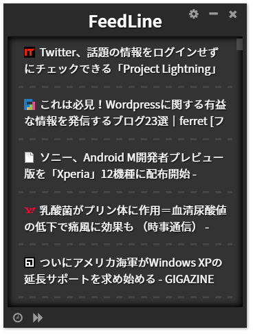

# FeedLine

新着記事を **“ゆっくりと”** 流すRSSリーダです。  
登録したフィードを **“Twitterのタイムラインのように”** 流し続けます。  

 *デスクトップの隅に置き、ふと目に入った記事を閲覧する。そんな使い方を想定しています。* 



## リリース（ダウンロード）

 ** 現在準備中です。 ** 

## 主な機能
- 登録したRSSフィードを巡回し、新着記事を表示します
	- 一度表示された記事は、以降表示されません
- ウィンドウが表示されない / 見つからない時は、```F1```キーを押してください
	- ディスプレイの中央に移動します

## 動作環境
- Windows
	- Windows 7 64bit環境で動作を確認
	- その他のWindowsは未確認
- Mac OS X
	- 透過機能が利用できないため、無効化したパッケージを用意

## ドキュメント
- ユーザ向け
	- [導入方法](./docs/install.md)
	- [使い方・画面説明](./docs/help.md)
- 開発者向け
	- [技術構成と実装](./docs/docs.md)
	- [実行可能パッケージの作成手順](./docs/package.md)
	- [NW.jsに関するメモ](./docs/nwjs.md)

## ToDo
- デフォルトRSSフィードの選定
- デフォルト値の持ち方どーするよ？
- NGワード
- NGドメイン
