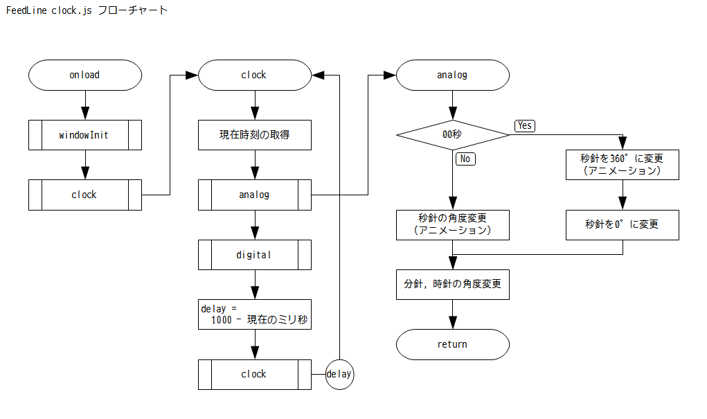

# FeedLine 技術構成と実装
## 構成
- NW.js v0.12.2-win-x64
	- Webの技術でGUIアプリケーションが作成できるフレームワーク
- Node.js パッケージ
	- request
		- getリクエストを行うパッケージ
	- feedparser
		- RSSフィードをパースするパッケージ
	- google-caja
		- サニタイズ処理などを提供
- jQuery 2.1.4
	- jQueryRotate 2.3
		- 要素の回転を行う（アナログ時計の針に利用）
- フォント
	- [Noto Sans Japanese](https://www.google.com/get/noto/)
		- 全てのテキスト（Web読み込み）
	- [Iceland](https://www.google.com/fonts/specimen/Iceland)
		- デジタル時計（Web読み込み）
	- [Font Awesome](http://fortawesome.github.io/Font-Awesome/) 4.3.0
		- アイコンセット（同梱）

### NW.jsについて
Node.js と Webkit により構成される、GUIアプリケーションのフレームワークです。  


## 実装
### メインウィンドウ


- configInit
	- 設定の読み込み
	- 設定が保存されていない場合、初期値をセットします
- windowInit
	- 前回終了時のウィンドウ位置・サイズを復元

#### 広告カット
記事タイトルやURLを、正規表現でフィルタリングしています。  
現状、フィルタリング条件は下記で固定です。
````
item.title.match(/^[\[［【\s]*(ad|pr|info|広告)[\]］】:：\s]*/i) || 
item.title.match(/[\[［【\s]*(ad|pr|info|広告)[\]］】:：\s]*$/i) || 
item.link.match(/^http:\/\/rss\.rssad\.jp\/rss\/ad\//i);
````


### 設定ウィンドウ

### 時計

