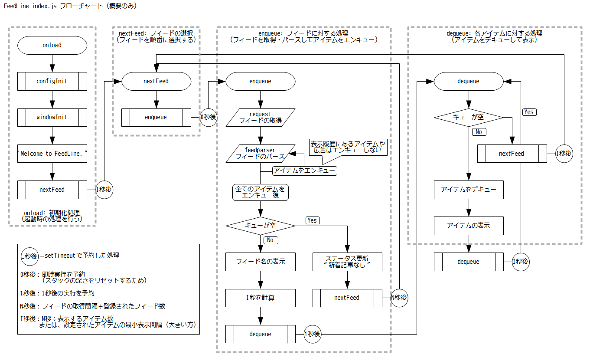

# FeedLine 技術構成と実装
## 技術構成
- NW.js v0.12.2-win-x64
	- Webの技術でGUIアプリケーションが作成できるフレームワーク
- Node.js パッケージ
	- request
		- getリクエストを行うパッケージ
	- feedparser
		- RSSフィードをパースするパッケージ
	- google-caja
		- サニタイズ処理などを提供
- jQuery 2.1.4
	- jQueryRotate 2.3
		- 要素の回転を行う（アナログ時計の針に利用）
- フォント
	- [Noto Sans Japanese](https://www.google.com/get/noto/)
		- 全てのテキスト（Web読み込み）
	- [Iceland](https://www.google.com/fonts/specimen/Iceland)
		- デジタル時計（Web読み込み）
	- [Font Awesome](http://fortawesome.github.io/Font-Awesome/) 4.3.0
		- アイコンセット（同梱）

### NW.jsについて
Node.js と Webkit により構成される、GUIアプリケーションのフレームワークです。  
HTML/CSSでレイアウトを組みJavaScriptで動作を作成するなど、Webの技術でGUIアプリが開発できます。  
また、jQueryのようなJavaScriptライブラリや、Node.jsのパッケージが利用できます。

## ファイル構成
```
/FeedLine/app
│                   
│  clock.html          // レイアウト 時計
│  config.html         // レイアウト 設定ウィンドウ
│  index.html          // レイアウト メインウィンドウ
│  package.json        // NW.jsの基本設定（メタデータとメインウィンドウのオプション）
│     
├─css
│      clock.css       // スタイル 時計
│      config.css      // スタイル 設定ウィンドウ
│      index.css       // スタイル メインウィンドウ
│      window.css      // ウィンドウの基本スタイル（メインウィンドウと設定ウィンドウで利用）
│      font-awesome.min.css  // アイコンセット「Font Awesome」
│      
├─fonts                // アイコンセット「Font Awesome」
│      
├─img
│      clock_bg.png    // 時計 背景
│      clock_hh.png    // 時計 時針
│      clock_mm.png    // 時計 分針
│      clock_ss.png    // 時計 秒針
│      favicon.ico     // アイコン exe用
│      icon.png        // アイコン メイン 256px
│      icon.xcf        // アイコン GIMP用原本
│      icon_16.png     // アイコン タスクトレイ用 16px
│      
├─js
│      clock.js        // 時計
│      config.js       // 設定ウィンドウ
│      exception.js    // 全ウィンドウへ適用するコード（例外処理など）
│      index.js        // メインウィンドウ
│      jquery-2.1.4.min.js          // ライブラリ「jQuery」
│      jQueryRotateCompressed.js    // ライブラリ「jQueryRotate」
│      
└─node_modules
    ├─feedparser    // Node.jsパッケージ「feedparser」
    ├─google-caja   // Node.jsパッケージ「google-caja」
    └─request       // Node.jsパッケージ「request」
```

## 実装
### メインウィンドウ

処理の主な流れを図式化しています。  
※ 大まか流れを示した図であり、細部は省略しています。



#### function
- configInit
	- 設定の読み込み
	- 設定が保存されていない場合、初期値をセット
- windowInit
	- ウィンドウの初期化（設定の読み込み、イベントの設定、表示）
- nextFeed
	- 次のフィードを選択し、enqueueの実行を予約する
		- 最後のフィードまで読み込んだら、最初のフィードに戻る
- enqueue
	- **request** によりフィードを取得
	- 取得したフィードを **feedparser** によりパース
	- パースされたフィードからアイテム（記事）を取り出し、エンキューする
	- 全てのアイテムを処理し終えたら、dequeueの実行を予約する
	- ただし、キューが空であればnextFeedの実行を予約する
- dequeue
	- キューに格納されたアイテム（記事）を取り出し、実際に表示する
	- アイテムを表示したら、dequeueの実行をもう一度予約する
	- キューが空であれば、nextFeedの実行を予約する

#### フィード関連の仕様
- 最初に読み込むフィードは、登録されたフィードの中からランダムに選ばれます
	- 移行は順次、最後まで読み込んだら最初のフィードに戻る
- フィードの取得間隔は、設定画面の設定値をフィードの数で割った値が利用されます
	- 例: 「60分毎に1度取得」 かつ 「15件のフィード」 が登録されていれば、  
	 → ```60分 ÷ 15件 ＝ 4分ごとに次のフィードを読み込みます```
- アイテムの表示間隔は、「フィードの取得間隔をアイテム数で割った値」または「設定画面の設定値」のより大きい方が利用されます
	- 例: 「フィードの取得間隔が4分」 かつ 「最低間隔が15秒」 かつ 「アイテムが10件」  
	 → ```max(4分 ÷ 10件 ＝ 24秒 , 15秒) ＝ 24秒ごとにアイテムが表示されます```
	- 例: 「フィードの取得間隔が4分」 かつ 「最低間隔が15秒」 かつ 「アイテムが30件」  
	 → ```max(4分 ÷ 20件 ＝ 8秒 , 15秒) ＝ 15秒ごとにアイテムが表示されます```

#### 広告カット
記事タイトルやURLを、正規表現でフィルタリングしています。  
現状、フィルタリング条件は下記で固定です。
````
item.title.match(/^[\[［【\s]*(ad|pr|info|広告)[\]］】:：\s]*/i) || 
item.title.match(/[\[［【\s]*(ad|pr|info|広告)[\]］】:：\s]*$/i) || 
item.link.match(/^http:\/\/rss\.rssad\.jp\/rss\/ad\//i);
````


### 設定ウィンドウ
設定は [localStorage](https://github.com/nwjs/nw.js/wiki/Save-persistent-data-in-app#web-storage) に保存しています。

### 時計


角度の変更は jQueryRotate により実装しています。

## デフォルトのRSSフィード
FeedLineでは、デフォルトで以下のRSSフィードを登録しています。
````
http://b.hatena.ne.jp/entrylist.rss
http://b.hatena.ne.jp/entrylist/news.rss
http://feeds.feedburner.com/hatena/b/hotentry
http://b.hatena.ne.jp/hotentry/it.rss
http://b.hatena.ne.jp/entrylist/it.rss

http://www.nikkeibp.co.jp/rss/select.rdf
http://www.nikkeibp.co.jp/rss/recommend.rdf
http://www.nikkeibp.co.jp/rss/buzz.rdf
http://www.nikkeibp.co.jp/rss/it.rdf

http://itpro.nikkeibp.co.jp/rss/ITpro.rdf
http://rss.rssad.jp/rss/itmtop/1.0/topstory.xml
http://rss.rssad.jp/rss/codezine/new/20/index.xml

http://rss.rssad.jp/rss/forest/rss.xml
http://rss.rssad.jp/rss/headline/headline.rdf

http://feeds.cnn.co.jp/rss/cnn/cnn.rdf
http://www3.nhk.or.jp/rss/news/cat0.xml
http://rss.rssad.jp/rss/mainichi/flash.rss
http://rss.asahi.com/rss/asahi/newsheadlines.rdf

http://rss.wor.jp/rss1/sankei/flash.rdf
http://rss.wor.jp/rss1/yomiuri/latestnews.rdf

http://news.google.com/news?hl=ja&ned=us&topic=h&ie=UTF-8&output=rss&num=100
http://news.google.com/news?hl=ja&ned=us&topic=t&ie=UTF-8&output=rss&num=100
````
