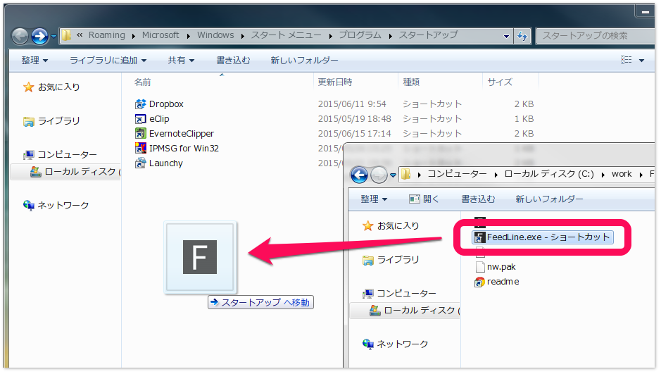
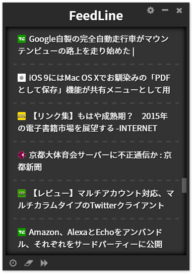
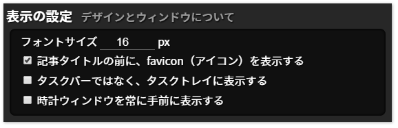

# FeedLine 使い方
- [導入手順](#導入手順)
- [Q&A](#qa)
- [メインウィンドウ](#メインウィンドウ)
- [設定ウィンドウ](#設定ウィンドウ)

## 導入手順
[ダウンロード](../README.md#ダウンロード)からOSに合わせたパッケージをダウンロードして下さい。  
インストーラ等は用意していないので、任意の場所に展開してご利用下さい。

### スタートアップへの登録（Windows）
スタートアップに登録することで、Windowsの起動時にFeedLineを自動的に起動することが出来ます。

1. FeedLineのフォルダを開き、 **FeedLine**（または **FeedLine.exe** ）のショートカットを作成します

2. スタートメニューの **スタートアップ** を右クリックし、 **開く** をクリックします  

3. 1.で作成したショートカットを、2.で開いた **スタートアップ** フォルダに移動します
  

自動起動をやめるときは、3.で移動したショートカットを削除してください。

## Q&A
- ウィンドウが表示されない / 見つからない
	- （Windows）タスクバーか ```Alt+Tab``` からFeedLineを選択し、 ```F1``` キーを押してください
	- ```F1``` キーを押すと、ウィンドウが画面中央に表示されます

## メインウィンドウ
はじめに表示されるウィンドウです。  
特別な操作は必要なく、新着記事が流れ続けます。

  

### 右上のボタン
  

- 左から順に
	- [設定ウィンドウ](#設定ウィンドウ)を開く
	- 最小化
	- FeedLineを終了する

### 左下のボタン
  

- 左から順に
	- [時計](#時計)を開く / 閉じる
	- 表示履歴をクリアする
		- 一度表示した記事をもう一度されるようになります
	- 次のフィードを取得する

#### 時計
  
シンプルなデジタル時計とアナログ時計です。  

メインウィンドウの[左下のボタン](#左下のボタン)から表示できます。

## 設定ウィンドウ
メインウィンドウの[右上のボタン](#右上のボタン)から表示できます。

設定は、設定ウィンドウを閉じた際に保存されます。  
また、基本的に適用はFeedLineの再起動後です。

### 動作の設定


- 同じフィードをおおよそ＿分毎に一度取得する
	- 同じフィードが指定した時間毎に取得されるよう、「フィードごとの表示時間」が調整されます
	- ※ 実際に取得する時間間隔は、より長くなります
- 最低でも＿秒間は次の記事を表示しない
	- 新着記事が多い場合、非常に早いペースで記事が流れるため、間隔の短さを制限出来ます
- ＿日前までの記事を表示する
	- 古い記事が表示されるのを防ぎます
	- ※ フィードに日時情報が無い場合、無条件に表示されます

### 表示の設定


- フォントサイズ＿px
	- FeedLineの基礎となるフォントサイズを指定します
	- 文字だけでなく、全体の大きさが連動して変化します
- タスクバーではなく、タスクトレイに表示する
	- FeedLineをタスクバーに表示せず、タスクトレイ（時計の横）に格納します
- 時計ウィンドウを常に手前に表示する
	- 時計を、他のウィンドウよりも手前に固定します

### フィードの管理


- RSSフィードのURL一覧
	- 購読するRSSフィードのURLを指定します
	- 1行に1つのURLを記載してください
