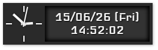

# FeedLine 使い方
## メインウィンドウ
はじめに表示されるウィンドウです。  
特別な操作は必要なく、新着記事が流れ続けます。

  

### 右上のボタン
  

- 左から順に
	- [設定画面](#設定画面)を開く
	- 最小化
	- FeedLineを終了する

### 左下のボタン
  

- 左から順に
	- [時計](#時計)を開く / 閉じる
	- 表示履歴をクリアする（一度表示した記事をもう一度表示する）
	- 次のフィードを取得する

## 設定画面
メインウィンドウの[右上のボタン](#右上のボタン)から表示できます。  
基本的に、設定は再起動後に適用されます。

  

### 動作の設定
- 同じフィードをおおよそ＿分毎に一度取得する
	- 同じフィードが指定した時間毎に取得されるよう、「フィードごとの表示時間」が調整されます。 
	- ※ 実際に取得する時間間隔は、より長くなります。
- 最低でも＿秒間は次の記事を表示しない
	- 新着記事が多い場合、非常に早いペースで記事が流れるため、間隔の短さを制限出来ます。
- ＿日前までの記事を表示する
	- 古い記事が表示されるのを防ぎます。
	- ※ フィードに日時情報が無い場合、無条件に表示されます。

### 表示の設定
- フォントサイズ＿px
	- FeedLineの基礎となるフォントサイズを指定します。
	- 文字だけでなく、全体の大きさが連動して変化します。
- タスクバーではなく、タスクトレイに表示する
	- FeedLineをタスクバーに表示せず、タスクトレイ（時計の横）に格納します。
- 時計ウィンドウを常に手前に表示する
	- 時計を、他のウィンドウよりも手前に固定します。

### フィードの管理
- RSSフィードのURL一覧
	- 購読するRSSフィードのURLを指定します。

## 時計
  
シンプルなデジタル時計とアナログ時計です。  
現時点では、その他の付加機能はありません。

メインウィンドウの[左下のボタン](#左下のボタン)から表示できます。
